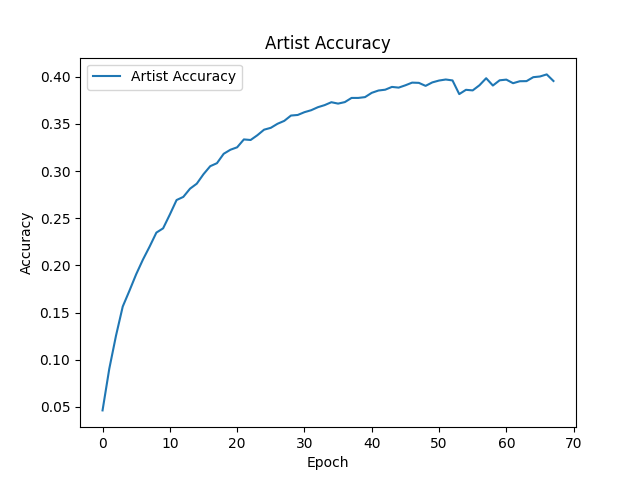
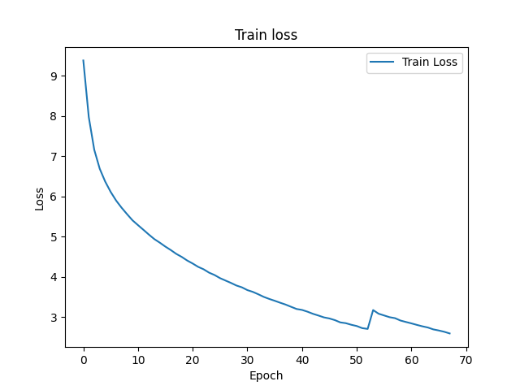
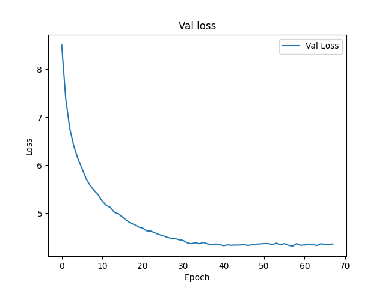
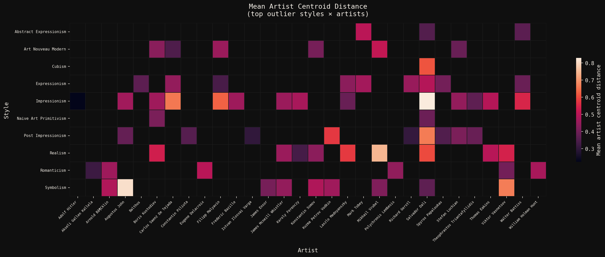
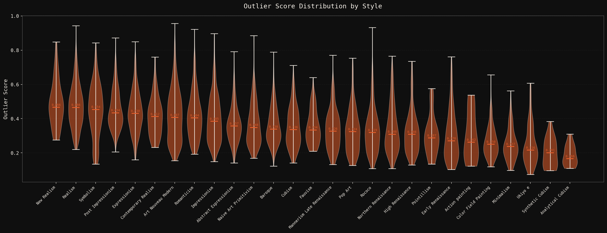
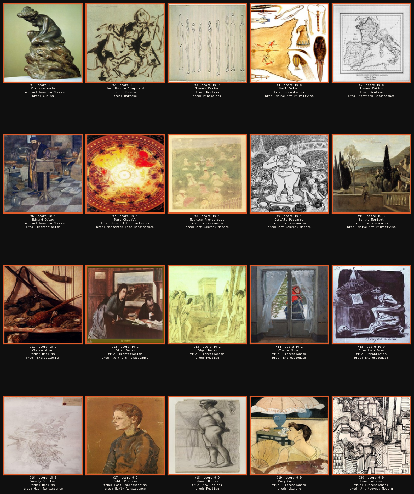

# ArtGAN: Multi-Task Art Classification

A CNN-RNN architecture for classifying paintings by style and artist using the WikiArt dataset.

## Architecture

- **Backbone**: ResNet50 pretrained on ImageNet (frozen during initial training)
- **Sequence Modeling**: Bidirectional LSTM with attention over spatial features
- **Classification Heads**: Separate heads for style (27 classes) and artist (1119 classes)
- **Training**: Mixed precision (bfloat16) with cosine annealing LR schedule

## Requirements

- Python 3.12+
- PyTorch 2.0+
- NVIDIA H100 GPU (or compatible CUDA device)

## Installation

```bash
uv sync
```

## Training

```bash
cd code
python train.py
```

Checkpoints are saved as `checkpoint_epoch_N.pt` after each epoch.

## Project Structure

```
├── code/
│   ├── cnn_rnn.py      # Model architecture
│   ├── dataset.py      # WikiArt dataset and dataloaders
│   ├── train.py        # Training loop
│   ├── find_outliers.py # Outlier detection script
│   └── validate.py     # Validation utilities
├── data/               # Dataset directory
└── main.py
```

## Results

Trained for 68 epochs: 53 epochs with frozen backbone, then 15 epochs fine-tuning the ResNet backbone.

| Task | Accuracy |
|------|----------|
| Style (27 classes) | 58.3% |
| Artist (1119 classes) | 40.0% |

## Classification Performance

| Style Accuracy | Artist Accuracy |
|:--------------:|:---------------:|
|  |  |

| Training Loss | Validation Loss |
|:-------------:|:---------------:|
|  |  |


## Outlier Detection

Outliers are identified by measuring how far an image's embedding is from the center of its assigned class (style or artist). The process is as follows:

1.  **Extract Embeddings**: For each image in the validation set, we extract its feature embedding using the trained model.
2.  **Calculate Centroids**: For each class (e.g., "Impressionism" style or "Vincent van Gogh"), we compute a "centroid" by averaging the embeddings of all images in that class.
3.  **Measure Distance**: We calculate the cosine distance between each image's embedding and its corresponding style and artist centroids. A higher distance means the image is less typical for its class.
4.  **Outlier Score**: The final outlier score is the average of the style and artist distances. Images with the highest scores are considered the biggest outliers.

| Outlier Heatmap | Outliers by Style |
|:---------------:|:-----------------:|
|  |  |

**Top 20 Outliers**

