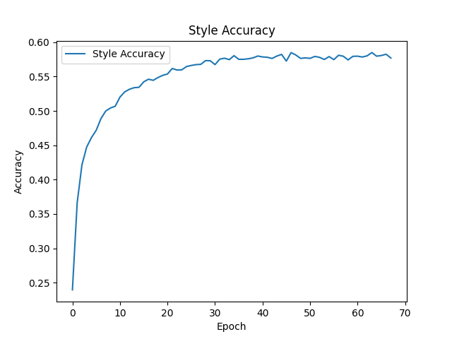

# ArtGAN: Multi-Task Art Classification

A CNN-RNN architecture for classifying paintings by style and artist using the WikiArt dataset.

## Architecture

- **Backbone**: ResNet50 pretrained on ImageNet (frozen during initial training)
- **Sequence Modeling**: Bidirectional LSTM with attention over spatial features
- **Classification Heads**: Separate heads for style (27 classes) and artist (1119 classes)
- **Training**: Mixed precision (bfloat16) with cosine annealing LR schedule

## Requirements

- Python 3.12+
- PyTorch 2.0+
- NVIDIA H100 GPU (or compatible CUDA device)

## Installation

```bash
uv sync
```

## Dataset

Download the WikiArt dataset (~25GB):

```bash
python scripts/download_data.py
```

Expected structure:
```
data/wikiart/
├── Abstract_Expressionism/
├── Baroque/
├── Cubism/
└── ...
```

## Training

```bash
cd scripts
python train.py
```

Checkpoints are saved as `checkpoint_epoch_N.pt` after each epoch.

## Project Structure

```
├── scripts/
│   ├── cnn_rnn.py      # Model architecture
│   ├── dataset.py      # WikiArt dataset and dataloaders
│   ├── train.py        # Training loop
│   └── validate.py     # Validation utilities
├── data/               # Dataset directory
└── main.py
```

## Results

Trained for 68 epochs: 53 epochs with frozen backbone, then 15 epochs fine-tuning the ResNet backbone.

| Task | Accuracy |
|------|----------|
| Style (27 classes) | 58.3% |
| Artist (1119 classes) | 40.0% |

### Training Curves

<p align="center">
  
  
</p>

<p align="center">
  
</p>
